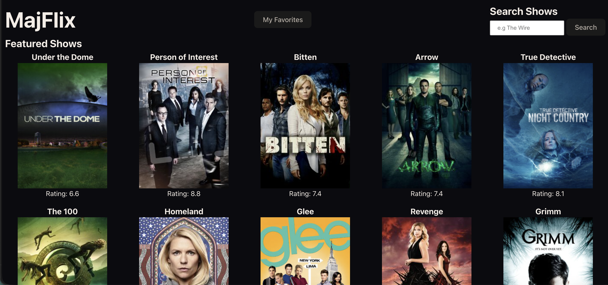
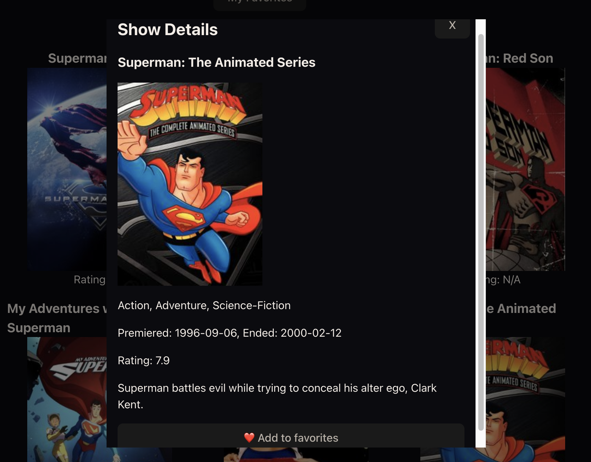

# MajFlix

MajFlix is a TV show browsing application that allows for users to explore a curated collecting of shows, search for specific titles, view detailed information about individual shows, and save their favorites for quick access. Built with vanilla JavaScript with HTML, CSS, Vite, and powered by the TV Maze API, MajFlix offers a clean, responsive experience across mobile and desktop devices.

## Project Info

### Website Link:

https://felix-majeed-mls.github.io/mod-4-project/

### Team Members:

- Felix: https://github.com/felixvargas7
- Majeed: https://github.com/melshabazz2

### API:

TV Mazed API - https://www.tvmaze.com/api

#### Endpoints

- `GET /shows`: Returns an array of all available shows
- `GET /shows/:id`: Returns detailed data for a single show
- `GET /search/shows?q=query`: Returns search results using a query

## Features

### MVP Features

- **Featured Shows** - On page load, a collection of shows is fetched from the TV Maze API. It is then rendered in a responsive grid layout. Users can browse the collection across mobile or desktop devices

- **Show Details** - Clicking on any show opens a modal displaying detailed information about the selected show, including name, genre, rating, air dates, and a summary.

- **Search** - A search form feature allows for users to search for shows by name. Results replace the featured shows collection with the search results, rendered in the same grid layout.

### Stretch Features

- **Favorites** - While viewing a show's details, users can decide to add or subsequently remove that show from their favorite list. The collection of favorites are stored in `localStorage`, allowing it to persist across page refreshes. Users can also switch between Featured Shows and their favorites by clicking the "My Favorites" button in the header section. Favorite shows will appear in the same grid layout as search results or featured shows collection.

## Techs Used

- HTML
- CSS
- JavaScript
- Vite
- TVMaze REST API
- `localStorage`
- Git/GitHub/GitHub Pages

## Setup Instruction

1. Clone the repository

```bash
    git clone https://github.com/felix-majeed-mls/mod-4-project.git
   cd mod-4-project
```

2. Install dependencies:

```bash
    npm install
```

3. Initialize development server:

```bash
    npm run dev
```

## Webpage Images

### Featured Shows



### Single Show Details



### Favorites Section


## Limitation & Future Improvements

- **Recommendations** - A future improvement we could implement would be a recommendations section. This section would utilize a users favorited show's genres and other data to suggest similar titles, giving users a more personalized browsing experience.

- **Advanced Search Filter** - An addition of "filters" for the search bar would give users a better way to find a specific title, or serve as a way to find shows that match specific data that the search filter would request, such as ratings, genres, air dates, etc.

- **Responsive display** - Empty state messages to an empty favorite section, as well as a "no results found" state message after not finding a specific title would allow for a more seamless user experience.
